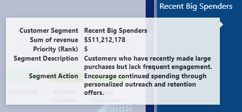

# RFM Customer Segmentation

RFM (Recency, Frequency, Monetary) customer segmentation model built in Power BI.

(235k+ transactions | 25k+ customers | 18 countries | ~2 years of sales data)

---

## Report Overview

  
  

---

## Custom Tooltip Layer

  

---

## Background

Recency, Frequency and Monetary value (RFM) is a widely used behavioral segmentation model in marketing analytics.  

It evaluates customers based on:

- **Recency** – how recently a customer made a purchase  
- **Frequency** – how often purchases are made  
- **Monetary Value** – how much revenue a customer generates  

The objective of this project was not only to calculate RFM scores, but to design a dynamic segmentation framework that translates raw transaction data into actionable customer intelligence.

---

## Dataset

- Real-world sales dataset (anonymized)
- 18 countries
- Approximately 2 years of transaction history
- Fact table: 235k+ transactions
- Customer dimension: 25k+ customers

Sensitive attributes (customer IDs, revenue values, country labels) were adjusted to preserve privacy.

---

## Data Preparation

All data transformation was performed in **Power Query**, including:

- Data cleaning and normalization
- Type transformation
- Removal of inconsistencies
- Creation of a custom `dimDate` table  
- Auto date/time disabled for controlled time intelligence modeling

The final structure follows a star-schema approach.

---

## Analytical Approach

Multiple segmentation structures (6, 8 and 12 segments) were evaluated before selecting the final model to balance analytical clarity and business usability.

The model includes:

- Calculated columns for R, F and M scoring
- Normalization of customer metrics
- SWITCH(TRUE())-based classification logic
- Segment prioritization logic
- Country-level dynamic filtering

A contextual custom tooltip layer was implemented to provide detailed customer insight directly from visual interactions.

---

## Key Technical Components

### DAX
- CALCULATE and context transition
- DIVIDE for safe ratio calculations
- MAXX over RELATEDTABLE
- SWITCH(TRUE()) classification framework
- Custom date table generation

### Modeling
- One-to-many relationships
- Controlled cross-filter direction (single and bi-directional where required)
- Structured star-schema design

### UX & Interaction
- Dynamic country filtering
- Custom tooltip page
- Page navigation and bookmarks

---

## Business Value

- Identifies high-value, loyal and at-risk customers
- Enables targeted retention strategy
- Supports revenue concentration analysis
- Converts transaction-level data into strategic customer insight

---

Demonstrates analytical modeling depth, structured DAX implementation and business-oriented data thinking.
