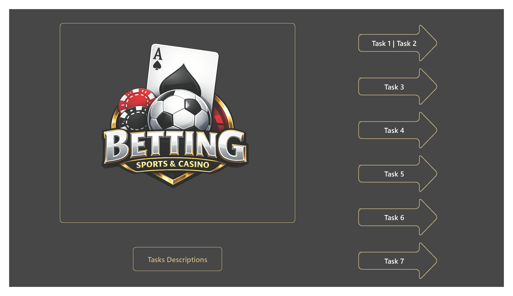
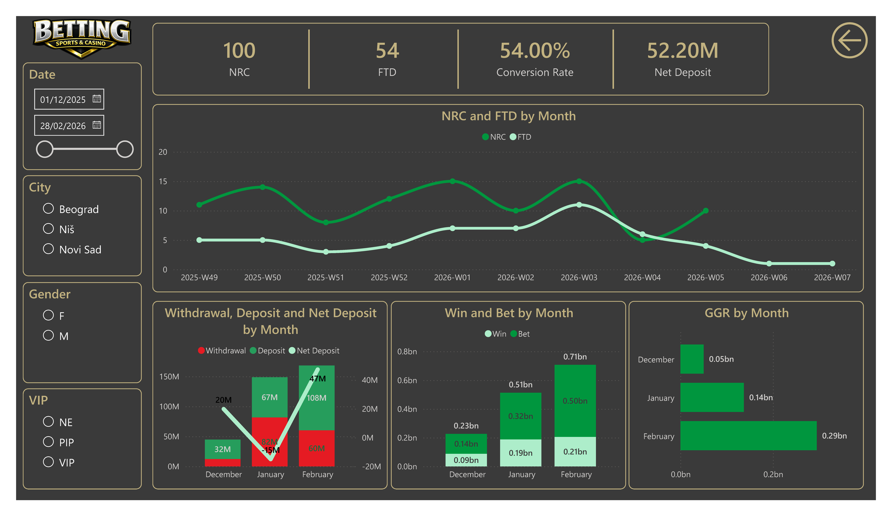
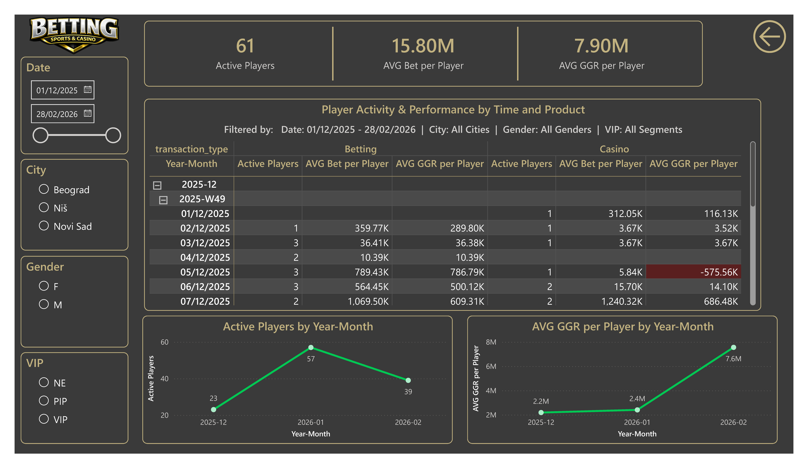
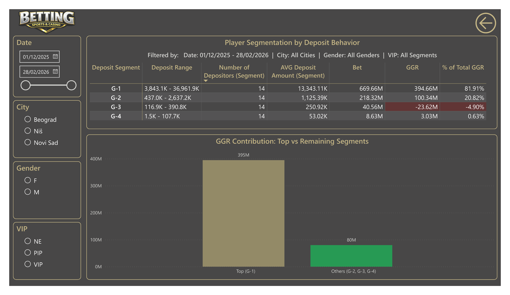
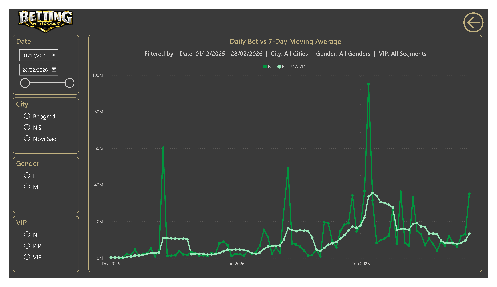
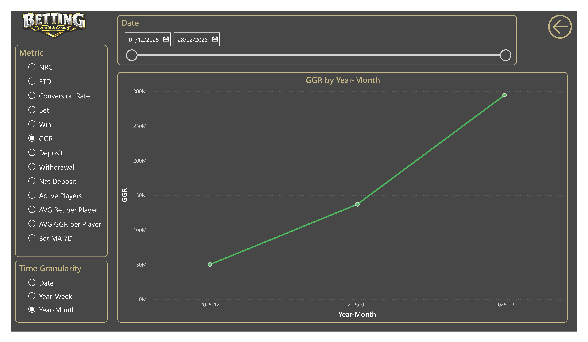
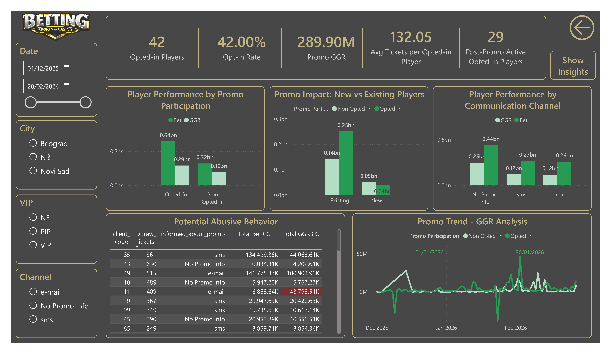
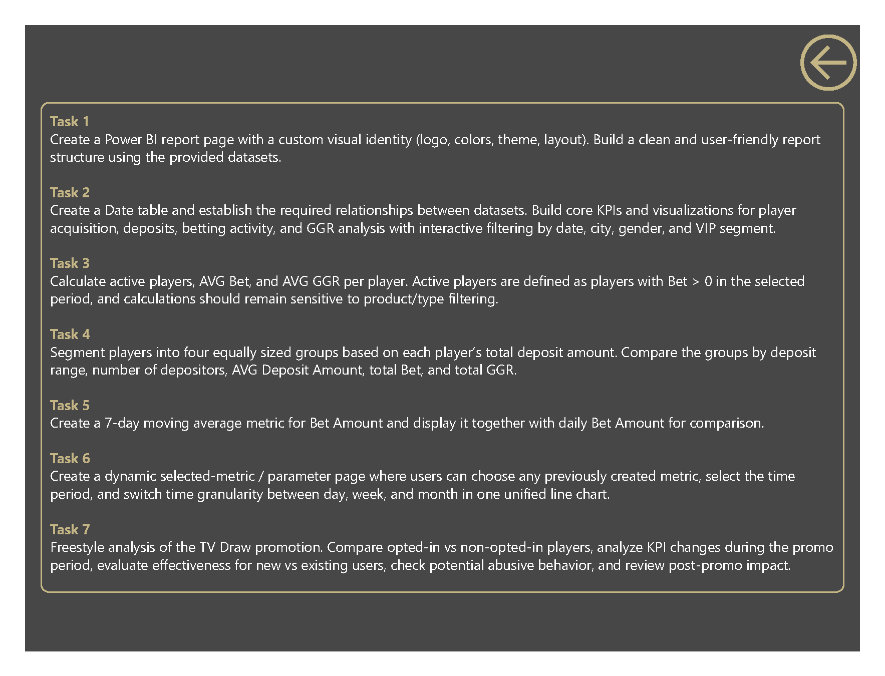
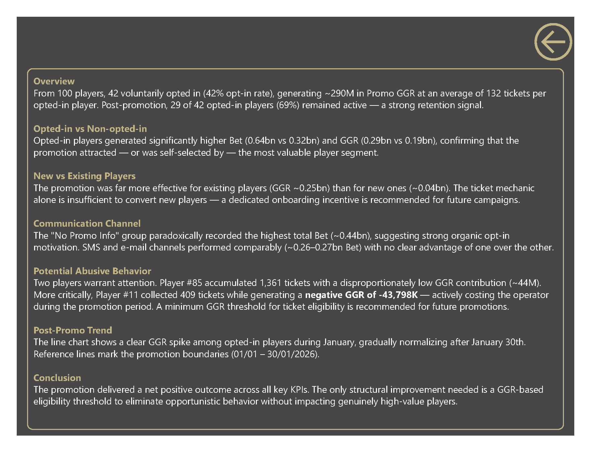

# Sports Betting CRM & Campaign Analytics

## Project Overview

This project was developed as an end-to-end Power BI case study for a sports betting and casino operator.

The objective was not only to demonstrate Power BI technical skills, but also to showcase:

- Data modeling and relationship design
- DAX-based KPI development
- Customer acquisition analysis
- Player segmentation techniques
- Promotional campaign effectiveness measurement
- Business-oriented insight generation

The report covers the complete analytical workflow from data preparation through executive-level reporting and campaign evaluation.

---

## Business Context

The dataset simulates a betting and casino environment containing:

- Player registrations
- First-time deposit behavior
- Betting and casino activity
- Deposits and withdrawals
- VIP segmentation
- Promotional campaign participation

The reporting structure follows seven business tasks:

1. Acquisition & KPI Monitoring
2. Data Modeling & Core Analytics
3. Player Activity Analysis
4. Deposit-Based Segmentation
5. Moving Average Trend Analysis
6. Dynamic KPI Exploration
7. Promotional Campaign Evaluation

---

# 1️⃣ Navigation Page

### Purpose

Provide a central landing page allowing navigation to all analytical sections of the report.

### Features

- Custom visual identity
- Sports betting themed branding
- Navigation buttons for all tasks
- Dedicated task description page

---

# 2️⃣ Acquisition & Financial Overview

### Purpose

Monitor player acquisition, conversion, deposits, betting activity and GGR performance.

### Key KPIs

- NRC (New Registered Clients)
- FTD (First Time Depositors)
- Conversion Rate
- Net Deposit

### Analytical Focus

- Registration trends
- Deposit conversion performance
- Deposit vs Withdrawal analysis
- Betting and Win comparison
- Monthly GGR evolution

---

# 3️⃣ Player Activity & Performance

### Purpose

Measure player engagement and profitability across Betting and Casino products.

### Key KPIs

- Active Players
- AVG Bet per Player
- AVG GGR per Player

### Business Value

This page helps identify:

- Product engagement patterns
- Revenue contribution by activity type
- Changes in player quality over time

---

# 4️⃣ Deposit Segmentation Analysis

### Purpose

Segment players into four equally sized deposit groups and compare their business contribution.

### Key Metrics

- Deposit Range
- Number of Depositors
- AVG Deposit Amount
- Total Bet
- Total GGR
- % Contribution to Total GGR

### Business Interpretation

The analysis highlights concentration of value among high-deposit customers and supports VIP targeting strategies.

---

# 5️⃣ Daily Bet vs 7-Day Moving Average

### Purpose

Compare daily betting volume against a rolling seven-day benchmark.

### Analytical Focus

- Short-term volatility
- Trend direction
- Peak activity detection
- Operational monitoring

This visualization reduces daily noise and reveals underlying player activity trends.

---

# 6️⃣ Dynamic KPI Explorer

### Purpose

Provide a flexible analytical environment where users can dynamically select:

- KPI
- Time period
- Time granularity

### Available Metrics

- NRC
- FTD
- Conversion Rate
- Bet
- Win
- GGR
- Deposit
- Withdrawal
- Net Deposit
- Active Players
- AVG Bet per Player
- AVG GGR per Player
- Bet MA 7D

### Technical Implementation

Built using Power BI Field Parameters for dynamic measure and axis switching.

---

# 7️⃣ TV Draw Promotion Analysis

### Purpose

Evaluate the effectiveness of the TV Draw promotional campaign.

### Focus Areas

- Opted-in vs Non Opted-in Players
- New vs Existing Players
- Communication Channel Performance
- Post-Promotion Retention
- Potential Abusive Behavior

### Key Findings

- 42% player opt-in rate
- Strong performance from opted-in players
- Existing players responded better than new players
- Several players exhibited suspicious ticket accumulation patterns

---

# 8️⃣ Task Description Page

### Purpose

Reference page containing the original assignment requirements and evaluation criteria.

---

# 9️⃣ Campaign Insights & Recommendations

### Key Conclusions

- The campaign generated positive business impact.
- Opted-in players produced significantly higher betting activity and GGR.
- Existing customers benefited more than newly acquired players.
- Communication channels showed similar performance levels.
- Introducing a GGR eligibility threshold could reduce opportunistic behavior while preserving campaign effectiveness.

---

## What This Project Demonstrates

- End-to-end Power BI development
- Power Query ETL design
- Star schema modeling
- Advanced DAX calculations
- USERELATIONSHIP implementation
- Moving average analytics
- Dynamic field parameters
- Customer segmentation
- Promotional campaign analysis
- Executive dashboard design

---

## Tools Used

- Power BI Desktop
- Power Query (M)
- DAX
- Data Modeling
- Field Parameters
- KPI Dashboard Design
- CRM & Campaign Analytics
