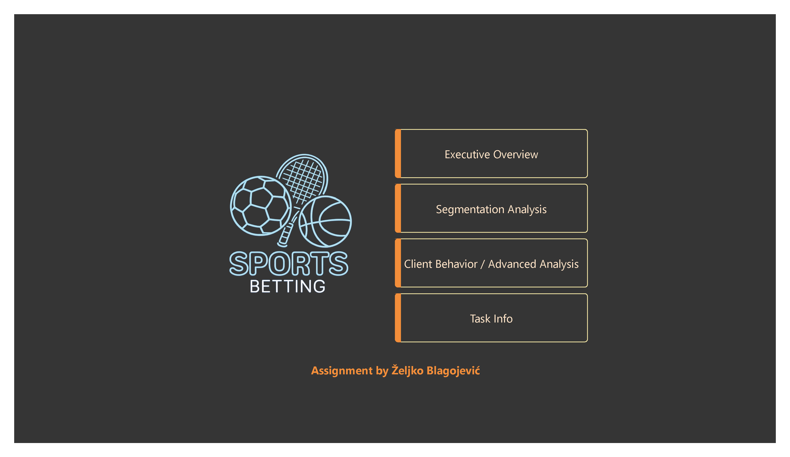
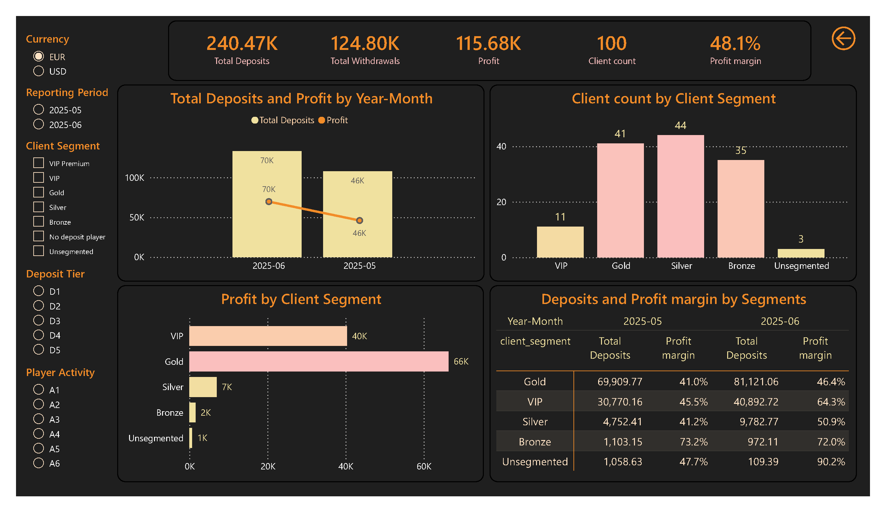
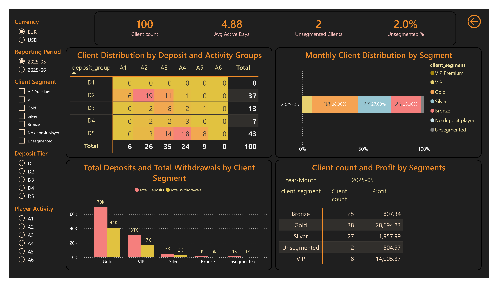
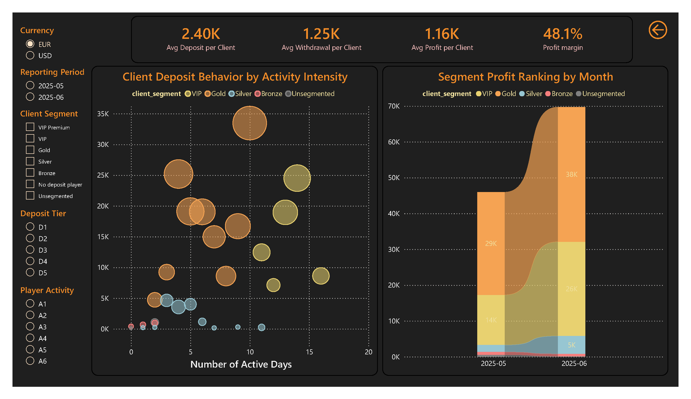
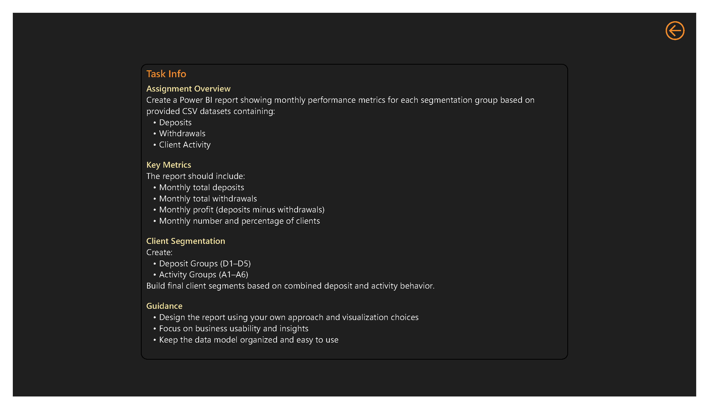

# Sports Betting Customer Analytics

## Project Overview

This project simulates a customer analytics environment for a sports betting operator focused on player segmentation, profitability analysis, and behavioral insights.

The objective was not to showcase technical ETL complexity or advanced data engineering techniques, but to demonstrate:

- Customer segmentation framework design
- Behavioral analytics and player value classification
- Profitability analysis across customer segments
- Executive-level KPI reporting
- Business-oriented dashboard storytelling

Technical implementation details such as Power Query transformations, data modeling, FX integration, and DAX calculations are intentionally not the primary focus of this document. Those aspects are covered separately within the project's technical documentation.

---

## Business Context

Sports betting operators continuously monitor player behavior to understand customer value, engagement intensity, and profitability.

Using deposits, withdrawals, and activity records, customers were classified into deposit tiers, activity groups, and business-oriented value segments. The resulting framework allows management to evaluate customer quality, identify high-value players, and understand the relationship between engagement and profitability.

The reporting structure follows three analytical layers:

1. Executive Performance Overview
2. Customer Segmentation Analysis
3. Behavioral & Profitability Analytics

The final solution provides a business-friendly framework for customer value management and supports CRM, retention, and commercial decision-making processes.

---

## Report Availability

This solution includes:

* Power BI Desktop report
* Optimized Mobile Layout
* Interactive Power BI Service report

**Live Report:**
[View Interactive Report](https://app.powerbi.com/view?r=eyJrIjoiYjUyMjFlMGUtN2E2NC00MTJlLTg5YTctYjc1ZTgwYWUwNjRiIiwidCI6ImExYmRlNTMwLTJkMDAtNDQ4ZC04MTExLWJmZTg5NzVhMWI0YiIsImMiOjl9)

The report was specifically designed to provide a consistent experience across desktop and mobile devices.

---

# 1️⃣ Navigation Page

### Purpose

Provide a central landing page allowing navigation to all analytical sections of the report.

### Features

- Executive Overview navigation
- Segmentation Analysis navigation
- Client Behavior & Advanced Analytics navigation
- Assignment Requirements page
- Consistent report branding and user experience

### Business Value

The navigation page serves as the report entry point, allowing users to quickly access all analytical areas while maintaining a structured storytelling flow throughout the report.

---

# 2️⃣ Executive Overview

### Purpose

Provide executive-level visibility into customer value, profitability, and overall platform performance.

### Focus Areas

- Total Deposits
- Total Withdrawals
- Profit
- Profit Margin
- Client Count
- Segment Contribution

### Key Elements

- Monthly deposits and profit trend
- Customer distribution across segments
- Profit contribution by segment
- Deposit and profitability comparison by segment

### Business Interpretation

This page allows management to quickly identify the most valuable customer groups and monitor overall business performance.

The analysis highlights which customer segments generate the highest contribution to deposits and profit while also providing visibility into customer portfolio composition and profitability development over time.

---

# 3️⃣ Segmentation Analysis

### Purpose

Analyze customer distribution across deposit and activity categories while validating the effectiveness of the segmentation framework.

### Segmentation Framework

#### Deposit Groups

| Group | Monthly Deposits |
|---------|---------|
| D1 | No Deposit |
| D2 | Up to 100 EUR |
| D3 | Up to 500 EUR |
| D4 | Up to 1,000 EUR |
| D5 | Above 1,000 EUR |

#### Activity Groups

| Group | Active Days |
|---------|---------|
| A1 | 0 |
| A2 | Up to 2 |
| A3 | Up to 5 |
| A4 | Up to 10 |
| A5 | Up to 20 |
| A6 | Above 20 |

### Key Elements

- Deposit × Activity heatmap
- Segment distribution analysis
- Monthly segment composition
- Deposits vs Withdrawals by segment
- Segment profitability comparison

### Business Interpretation

This section demonstrates how customer value is distributed throughout the portfolio.

The analysis reveals concentration patterns, identifies dominant customer groups, and highlights opportunities for migration toward higher-value segments through CRM and retention initiatives.

---

# 4️⃣ Client Behavior & Advanced Analytics

### Purpose

Provide deeper insight into customer engagement patterns and profitability drivers.

### Focus Areas

- Activity intensity vs deposit behavior
- Profitability by customer segment
- Customer value distribution
- Segment performance evolution

### Key Elements

- Behavioral scatter analysis
- Profit ranking by segment
- Average customer value indicators
- Profit evolution across reporting periods

### Business Interpretation

This section helps connect customer behavior with financial outcomes.

The analysis demonstrates that profitability is not driven solely by deposit volume but also by player engagement intensity and activity consistency.

High-value segments emerge as a combination of strong deposit behavior and sustained activity, supporting more informed customer management strategies.

---

# 5️⃣ Assignment Requirements

### Purpose

Provide transparency regarding the original business requirements and project scope.

### Assignment Objectives

- Monthly Deposits
- Monthly Withdrawals
- Monthly Profit
- Monthly Customer Counts
- Deposit-Based Segmentation
- Activity-Based Segmentation
- Combined Customer Value Segmentation

### Additional Enhancements

Beyond the original requirements, the solution incorporates:

- Customer profitability analysis
- Behavioral analytics
- Dynamic currency switching (EUR/USD)
- Segment performance monitoring
- Executive dashboard navigation and storytelling

---

## What This Project Demonstrates

- Customer segmentation framework design
- Customer value analytics
- Profitability analysis
- Behavioral customer analysis
- Executive KPI reporting
- Business-oriented dashboard development
- Analytical storytelling
- CRM and retention-oriented reporting

---

## Technical Note

This project intentionally prioritizes business interpretation and customer analytics rather than technical implementation complexity.

The underlying solution includes:

- Star schema data model
- Monthly customer fact table
- Power Query transformation layer
- Dynamic EUR/USD currency switching
- Live FX rate integration via Frankfurter API
- DAX-based KPI framework

Full implementation details are documented separately within the project's technical documentation.

---

## Tools Used

- Power BI Desktop
- Power Query
- DAX
- Data Modeling
- Customer Segmentation
- Business Analytics
- Frankfurter FX API
- KPI-Driven Dashboard Design
