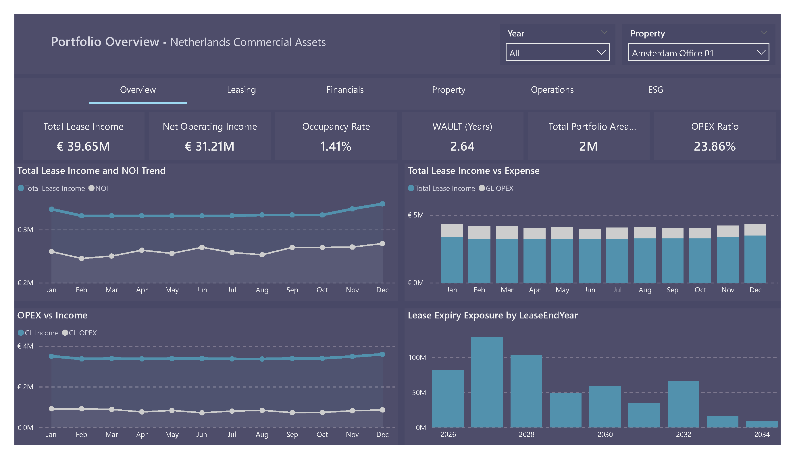
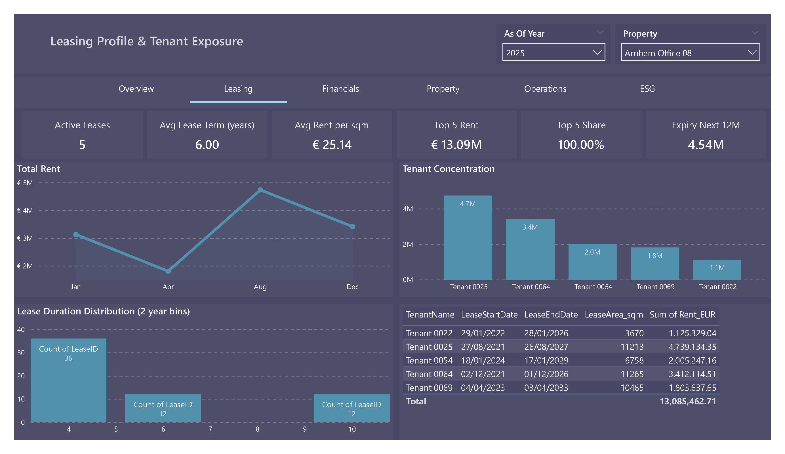
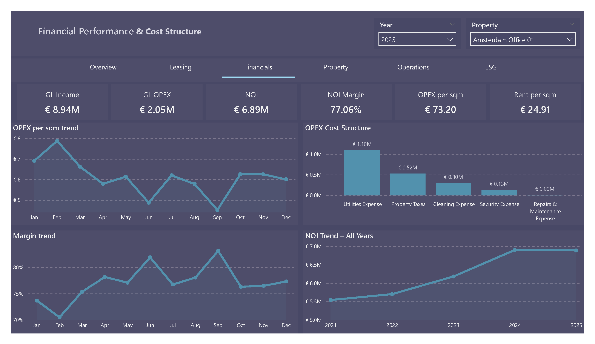
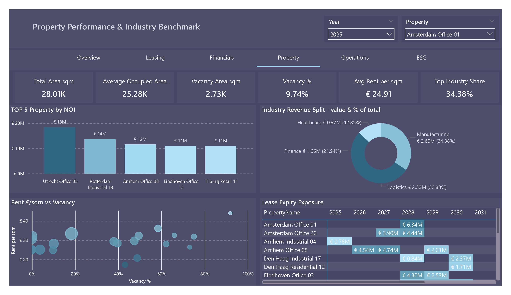
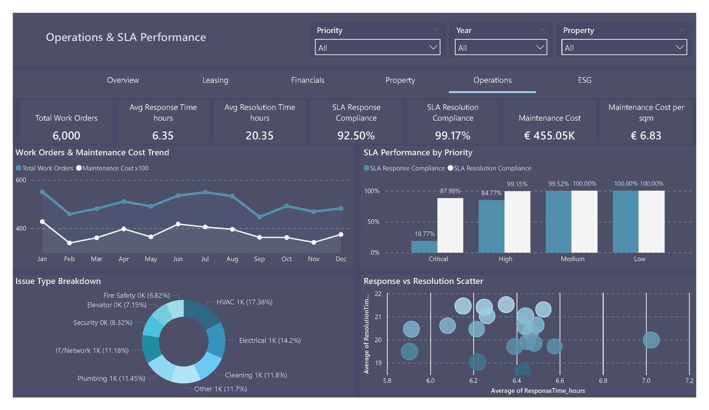
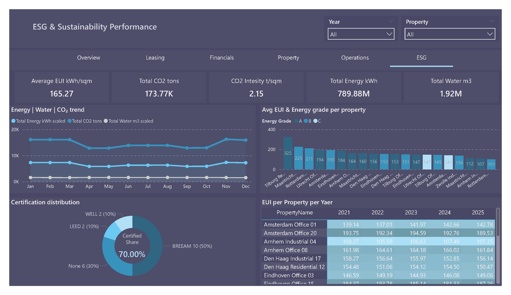

# TALCOM Enterprise Real Estate Performance Analysis

## Project Overview

This project simulates an enterprise-level real estate performance reporting solution designed for a property portfolio environment similar to TALCOM’s domain.

The focus of this project is not on technical implementation details, but on demonstrating a structured understanding of:

- Commercial real estate business logic  
- Leasing dynamics and tenant exposure  
- NOI and margin mechanics  
- Cost structure and OPEX behavior  
- Vacancy and industry exposure analysis  
- Operational SLA performance  
- ESG and sustainability performance metrics  

The dataset is synthetically designed to reflect realistic portfolio behavior across multiple properties and years.

---

## Business Context

In enterprise real estate environments, management typically requires:

- Portfolio-level performance visibility  
- Property-level benchmarking  
- Lease maturity risk analysis  
- Tenant concentration risk assessment  
- Operational SLA monitoring  
- ESG compliance tracking  

This project mirrors those reporting needs using a structured, decision-oriented BI model.

---

## Report Structure

---

### 1️⃣ Portfolio Overview

**Key KPIs**

- Total Lease Income  
- Net Operating Income (NOI)  
- Occupancy Rate  
- WAULT (Weighted Average Unexpired Lease Term)  
- Total Portfolio Area  
- OPEX Ratio  

**Core Logic**

NOI = Lease Income – Operating Expenses  

WAULT reflects income stability and long-term lease security.  
OPEX Ratio highlights cost efficiency.

---

### 2️⃣ Leasing Profile & Tenant Exposure

**Focus Areas**

- Active leases  
- Average lease term  
- Rent per sqm  
- Top 5 tenant concentration  
- Lease expiry distribution  

This layer highlights tenant dependency risk and lease rollover exposure.

---

### 3️⃣ Financial Performance & Cost Structure

**Core Metrics**

- GL Income  
- GL OPEX  
- NOI Margin  
- OPEX per sqm  
- Rent per sqm  

Cost categories include utilities, taxes, maintenance, security, and cleaning.

This page emphasizes operational efficiency and profitability drivers.

---

### 4️⃣ Property Performance & Benchmarking

**KPIs**

- Total Area  
- Vacancy Area  
- Vacancy %  
- Avg Rent per sqm  
- Industry revenue split  

The rent vs vacancy analysis supports asset-level benchmarking and pricing evaluation.

---

### 5️⃣ Operations & SLA Performance

**KPIs**

- Total Work Orders  
- Avg Response Time  
- Avg Resolution Time  
- SLA Compliance %  
- Maintenance Cost per sqm  

Operational performance impacts tenant retention and cost control.

---

### 6️⃣ ESG & Sustainability Performance

**Sustainability Metrics**

- Energy Use Intensity (EUI)  
- CO₂ Emissions  
- CO₂ Intensity per sqm  
- Energy Consumption  
- Water Usage  
- Certification distribution  

This section aligns portfolio reporting with institutional ESG standards.

---

## Analytical Design Philosophy

This project intentionally prioritizes:

- Business modeling  
- Metric logic  
- Performance interpretation  
- Portfolio risk assessment  

It does not focus on ETL pipelines or data modeling architecture.  
Those technical capabilities are demonstrated in other projects within this portfolio.

---

## Key Business Formulas Used

NOI = Lease Income – Operating Expenses  

NOI Margin = NOI / Lease Income  

OPEX per sqm = Total OPEX / Total Area  

Vacancy % = Vacant Area / Total Area  

WAULT = Weighted average remaining lease term  

Maintenance Cost per sqm = Maintenance Cost / Total Area  

---

## Skills Demonstrated

- Real estate financial modeling  
- Portfolio-level performance analytics  
- Risk exposure analysis  
- Executive KPI structuring  
- Business-driven BI storytelling  
- SLA and ESG metric integration  

---

## Conclusion

This project demonstrates the ability to translate enterprise real estate business logic into structured analytical reporting aligned with institutional asset management practices.
