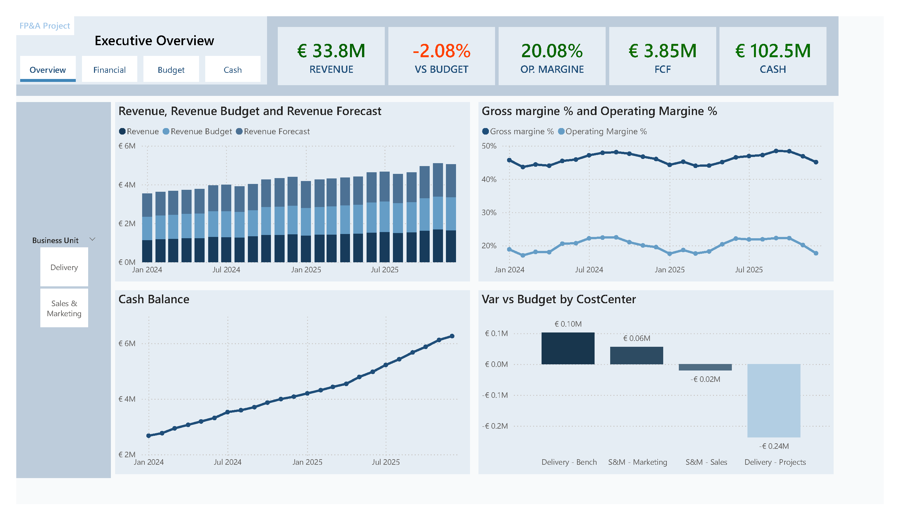
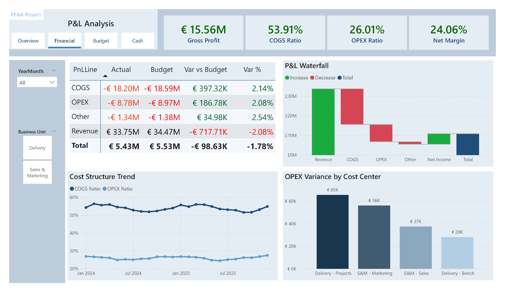
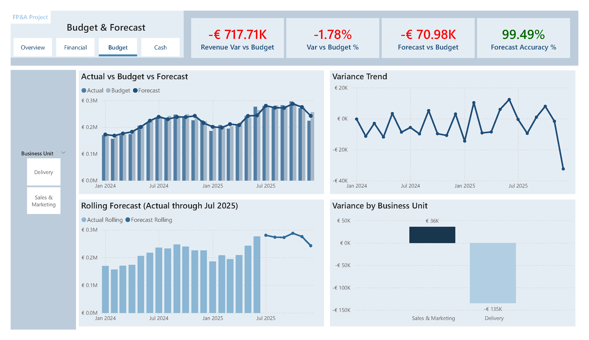
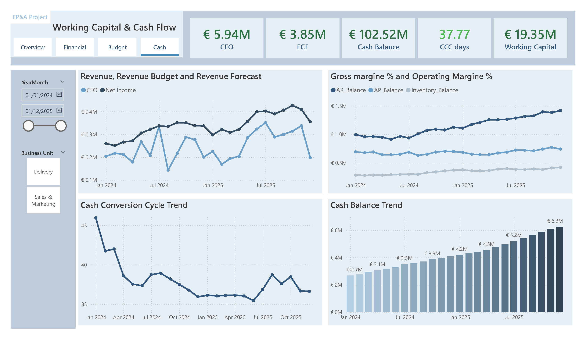

# Zuhlke FP&A

## Project Overview

This project simulates an enterprise-level FP&A reporting environment aligned with budgeting, forecasting, margin management and working capital steering processes.

The objective was not to showcase technical ETL or modeling complexity, but to demonstrate:

- Understanding of FP&A governance and performance logic  
- Correct financial KPI design and variance attribution  
- Alignment between Actuals, Budget and Forecast  
- Executive-level performance communication  

Technical modeling aspects (data transformation, relationships, DAX optimization, etc.) are intentionally not the focus here. Those can be reviewed in other projects within the portfolio.

---

## Business Context

The dataset simulates a services-oriented organization structured around:

- Revenue
- COGS
- OPEX
- Business Units (Delivery vs Sales & Marketing)
- Budget and Forecast scenarios
- Working Capital components (AR, AP, Inventory)

The reporting structure follows standard FP&A cycles:

1. Executive performance overview  
2. P&L structure and margin diagnostics  
3. Budget vs Forecast governance  
4. Working Capital & Cash Flow steering  

---

# 1️⃣ Executive Overview

### Purpose

Provide executive-level financial steering visibility across:

- Revenue performance
- Budget variance
- Operating margin
- Free Cash Flow
- Cash position

### Focus Areas

- Revenue growth trend
- Budget deviation monitoring
- Margin stability
- Liquidity development
- Cost center variance contribution

This page supports high-level management reporting and monthly performance reviews.

---

# 2️⃣ P&L Analysis

### Purpose

Deliver structured P&L visibility with clear variance attribution.

### Key Elements

- Actual vs Budget by P&L line
- Variance logic aligned with financial interpretation:
  - Favorable cost variance shown positive
  - Unfavorable revenue variance shown negative
- Margin ratio trend analysis (COGS %, OPEX %)
- Waterfall bridge from Revenue to Net Income
- OPEX variance breakdown by cost center

### Business Interpretation

This section demonstrates:

- Correct treatment of cost vs revenue variances  
- Margin compression/expansion analysis  
- Structural cost behavior diagnostics  

---

# 3️⃣ Budget & Forecast

### Purpose

Align planning cycles with financial governance and forecasting accuracy monitoring.

### KPI Framework

- Revenue Variance vs Budget  
- Variance % (normalized by Budget)  
- Forecast vs Budget  
- Forecast Accuracy %  

### Analytical Components

- Actual vs Budget vs Forecast comparison  
- Variance trend over time  
- Rolling forecast logic  
- Business Unit variance contribution  

### Governance Logic

- Variances expressed consistently across revenue and cost lines  
- Forecast accuracy calculated using absolute error logic  
- Clear separation between planning deviation and execution deviation  

This page reflects practical FP&A monthly review logic.

---

# 4️⃣ Working Capital & Cash Flow

### Purpose

Provide operational liquidity and working capital steering visibility.

### Core KPIs

- CFO (Cash Flow from Operations)
- FCF (Free Cash Flow)
- Cash Balance
- Cash Conversion Cycle (CCC)
- Working Capital

### Working Capital Logic

Cash Conversion Cycle calculated as:

CCC = DSO + DIO – DPO

Where:
- DSO = Receivables efficiency
- DIO = Inventory efficiency
- DPO = Payables leverage

The CCC KPI is conditionally formatted based on operational range thresholds rather than simple positive/negative logic.

### Analytical Focus

- Liquidity evolution
- AR / AP / Inventory balance trends
- CCC structural behavior
- Cash accumulation dynamics

This section demonstrates understanding of operational finance beyond pure P&L analysis.

---

## What This Project Demonstrates

- FP&A variance governance logic  
- Budget vs Forecast control framework  
- Financial ratio interpretation  
- Margin and cost structure diagnostics  
- Working capital steering mechanics  
- Executive reporting structure design  

---

## Technical Note

This project intentionally prioritizes business logic and financial interpretation.

Data modeling, DAX optimization, and technical architecture design are covered extensively in other portfolio projects.

---

## Tools Used

- Power BI  
- DAX  
- Scenario-based financial modeling  
- KPI-driven dashboard design  
